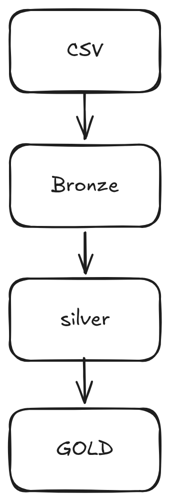

## About Project

This is the project to challenge from Koin, in resume the project is a pipeline creation with medalion architecture layer.
Bronze - Ingestion layer
Silver - Treatment layer
Gold - Bussiness consuption layer

## The project is using Python with lib to read CSV, validation schemas (Pydantic) and tests using Pytest. More explain in file [explain-decisions](explain-decisions.md)

## Architecture



### Bronze

This layer read the raw CSV like the source and adding a metadata to for the rastreability.
Metadata:

- ingestion timestamp
- source file
- row_number
- Is valid field to identify (for this layer this field is only false if the pydantic can not validate)
- Error message

### Silver

In this layer I applied this rules:

- Parse the dates from multiple formats ([date_parser](https://github.com/lucasvieira-tx/desafio-koin/blob/0f502cd55169c996ff05657f2fe9bbe8141b42aa/src/utils/date_parser.py#L4))
- Parse money values ([amount_parser](https://github.com/lucasvieira-tx/desafio-koin/blob/0f502cd55169c996ff05657f2fe9bbe8141b42aa/src/utils/amount_parser.py))
- Validate the `status` and `payment_method`
- Treatment fields
- Deduplication
- Decide the invalid data

### Gold

In this layer I anonymized the values (email) and validate the orders who has refence in non-existent customers.

---

## Project Structure

desafio-koin/
├── data/
│ ├── raw/
│ ├── bronze/
│ ├── silver/
│ ├── gold/
│ └── rejected/
├── docs/
├── src/
│ ├── schemas/
│ ├── utils/
│ ├── layers/
│ └── pipeline.py
├── tests/
├── requirements.txt
└── README.md
└── explain-decisions.md
└── .gitignore

---

## How to Run

To run this project the Python is needed.

### 1 - Create a virtual enviromment and activate

```bash
python -m venv .venv
source .venv/bin/activate
```

### 2 - INstall all dependencies

```bash
pip install -r requirements.txt
```

### 3 - Run the pipeline

```bash
python -m src.pipeline
```

## How to Run Tests

```bash
pytest tests/ -v
```

---

## Expected generated Outputs

When execute the flow this files will be created

```
data/bronze/
data/silver/
data/gold/
data/rejected/
```
